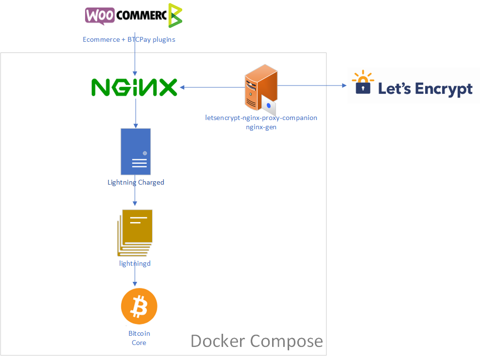

# Lightning Charge Docker-Compose

## Introduction

Using docker-compose, easily create a nearly production solution for accepting lightning payments, built on top of [c-lightning](https://github.com/ElementsProject/lightning)

It is basically a combination of:

* Let's encrypt for automatic SSL Certrenewal
* NGINX with docker-gen
* Bitcoin Core full node
* LightningD
* Lightning Charged

## Features

* Simple HTTP REST API, optimized for developer friendliness and ease of integration. Near-zero configuration.

* Supports invoice metadata, fiat currency conversion, long polling, web hooks, websockets and server-sent-events.

* Built-in checkout page, can be iframed or redirected to.

:zap: radically low fees :zap: nano payments :zap: instant confirmations :zap:

## Getting Started

The following environment variable are used:

* `NBITCOIN_NETWORK`: the blockchain identifier used by NBitcoin (eg., `regtest`, `testnet`, `mainnet`)
* `CHARGED_HOST`: the external url used to access the NGINX server from internet. This domain name must point to this machine for Let's Encrypt to create your certificate. (typically with a CNAME or A record)
* `LETSENCRYPT_EMAIL`: The email Let's Encrypt will use to notify you about certificate expiration.
* `ACME_CA_URI`: Let's encrypt API endpoint (`https://acme-staging.api.letsencrypt.org/directory` for a staging certificate, `https://acme-v01.api.letsencrypt.org/directory` for a production one)
* `CHARGED_ALIAS`: the lignthning node alias
* `CHARGED_IP`: the public ip of this node

**Create a .env file (containing the needed variables) in the same directory containing the docker-compose.yml,
then run 'docker-compose up -d'**

**Create a bitcoin-cli shortcut to interface with the node**
root@docker:~# **vim /usr/local/bin/bitcoin-cli**
#!/usr/bin/env bash
docker run --rm --network container:lightning_bitcoind_1 -v lightning_bitcoin_data:/data lodotek/bitcoin-core:0.16.1 bitcoin-cli "$@"

**Create a lightning-cli shortcut to interface with the node**
#!/usr/bin/env bash
docker run --rm -v lightning_clightning:/data -v lightning_bitcoin_data:/etc/bitcoin --entrypoint /usr/bin/lightning-cli lodotek/lightning-charge:latest "$@"

root@docker:~# **chmod +x /usr/local/bin/lightning-cli**
root@docker1:~# **lightning-cli getinfo**
{ "id" : "09e71ed1bbhdcf41d97e06ef3dfe4cdf79e871e9a3c8f9ab32b78e71deb45bf58c", "port" : 9735, "address" :
	[  ], "version" : "v0.5.2-2016-11-21-1414-g5eceaa7", "blockheight" : 505236 }

